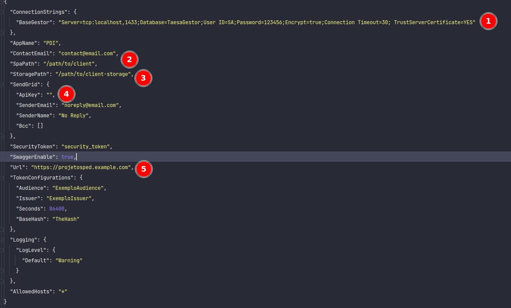

# Sistema PDI

Sistema de gerenciamento de projetos de pesquisa e desenvolvimentos

## Prerequisitos

[.NET Core SKD](https://dotnet.microsoft.com/download) instalado\
[ASP.NET Core Runtime 3.1](https://dotnet.microsoft.com/download/dotnet/3.1) instalado\
[SqlServer](https://www.microsoft.com/pt-br/sql-server/sql-server-downloads) instalado ou com acesso a um servidor
sqlserver

## Instalação

```bash
git clone caminho_do_repositório
cd ./caminho-do-repositorio
```

- Duplique o arquivo appsettings.example.json com o nome appsettings.json

```bash
cp ./PeD/appsettings.example.json ./PeD/appsettings.json
```



> Configurações necessárias

1) `ConnectionStrings.BaseGestor` string de conexão com o banco de dados.
2) `SpaPath` é o caminho onde o client(SPA) do sistema foi compilado.
3) `StoragePath` é a pasta onde os arquivos gerados pelo sistema deverão ser salvos  (Obs.: Somente caminho absoluto).
4) `ApiKey` do Sendgrid para o disparo de emails.
5) `Url` do sistema.
6) `CorsOrigin` Urls que podem fazer requisições

---

## Rodando a aplicação

```bash
dotnet watch run -p Ped/Ped.csproj
```

Ou

```bash
dotnet run
```
> Acesse a [aplicação](http://localhost:5000) e crie o usuário administrador


---

## Deployment

```bash
dotnet publish -c Release
```


## Built With

- [.NET Core](https://dotnet.microsoft.com/) - Plataforma de desenvolvimento usada

## Authors

- **Cristiano Chermont** - _Initial work_ - [xerminada](https://github.com/xerminada)
- **Diego França** - [diegointerativa](https://github.com/diegointerativa) [diihveloper](https://github.com/diihveloper)
